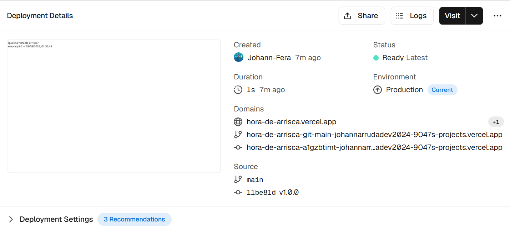
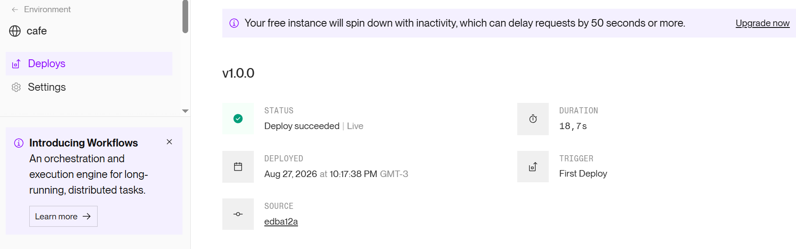
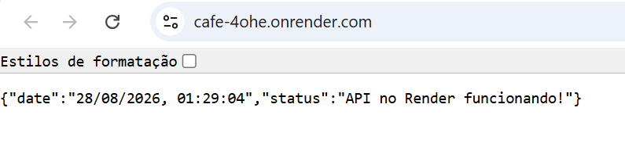
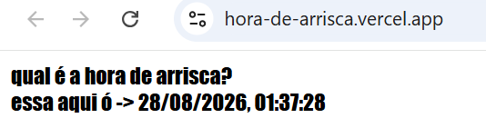
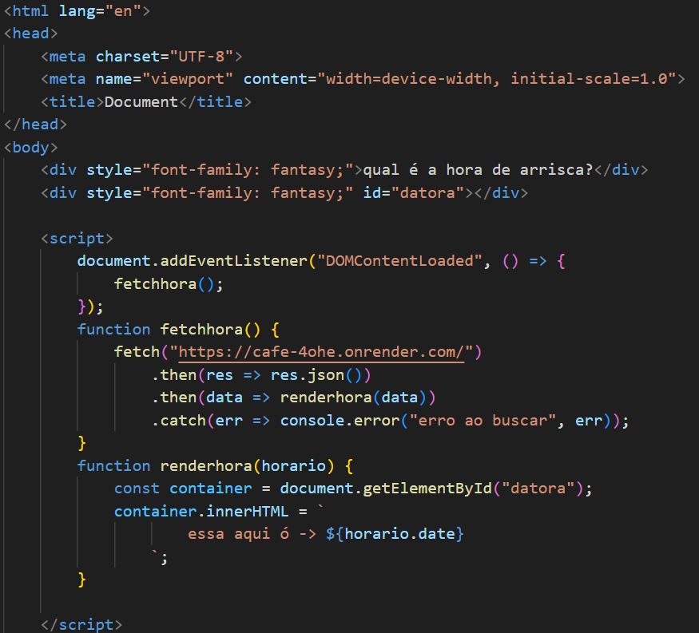
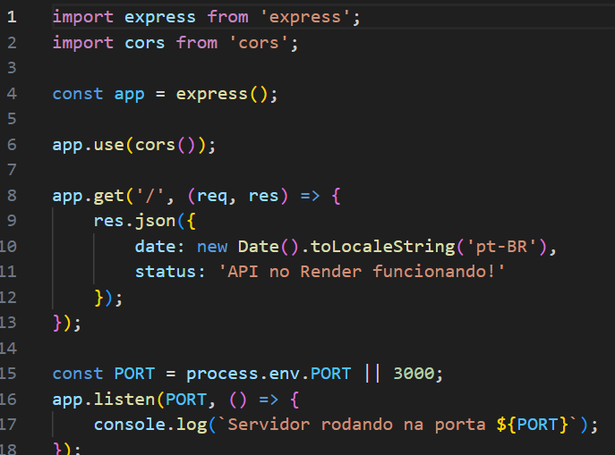

# Acesso para os repositórios da atividade 4_2

[Backend](https://github.com/Johann-Fera/cafe)

[Render](https://cafe-4ohe.onrender.com/)

[Frontend](https://github.com/Johann-Fera/hora-de-arrisca)

[Vercel](https://hora-de-arrisca.vercel.app/)

Front-end na Vercel

Back-end no Render

Back-end funcionando

Front-end funcionando

código do front-end

código do back-end
