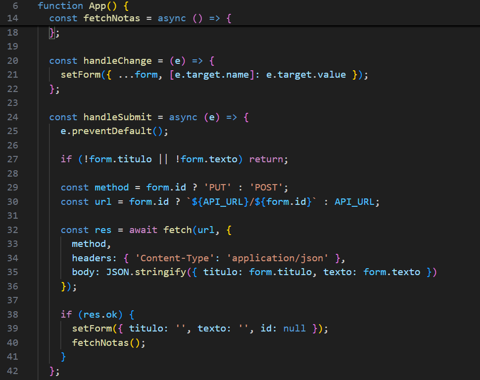
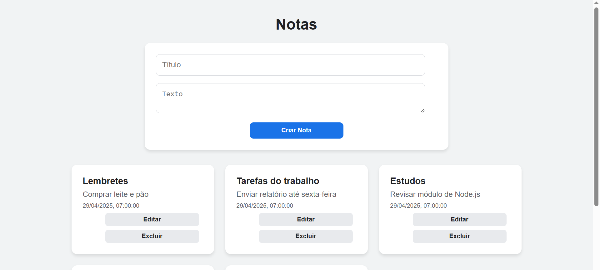
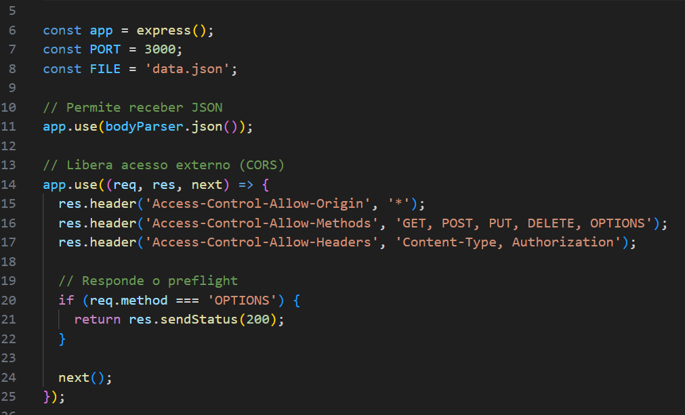
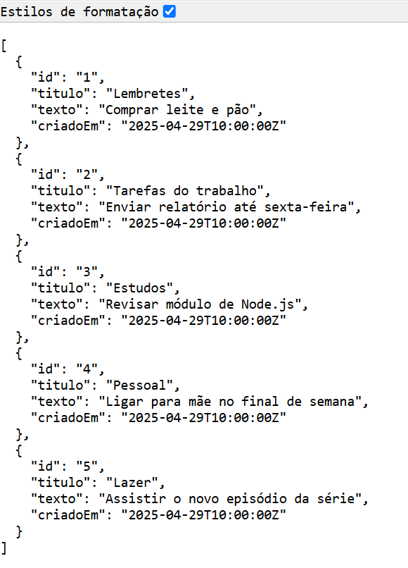

# Acesso para os repositórios da atividade 5

[Backend](https://github.com/Johann-Fera/exemplo-api-backend-main)

[Render](https://exemplo-api-backend-main.onrender.com/)

[Frontend](https://github.com/Johann-Fera/exemplo-api-frontend-master)

[Vercel](https://exemplo-api-frontend-master.vercel.app/)

[Postman](https://johannarruda-dev2024-7152521.postman.co/workspace/Johann-Arruda-Andrade's-Workspa~49bf6409-73eb-472d-871e-c0f6e8aba661/collection/57955692-e8c2afe7-d5f7-47d3-b50b-018beae72515?action=share&creator=57955692)

Código Front-end

Front-end funcionando

Código Back-end

Back-end funcionando

