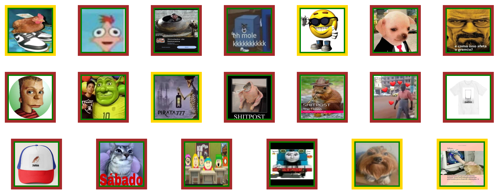
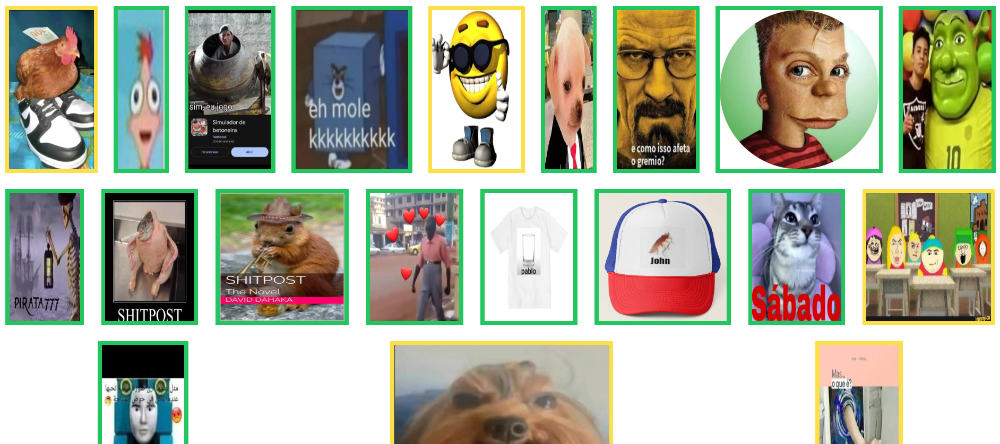
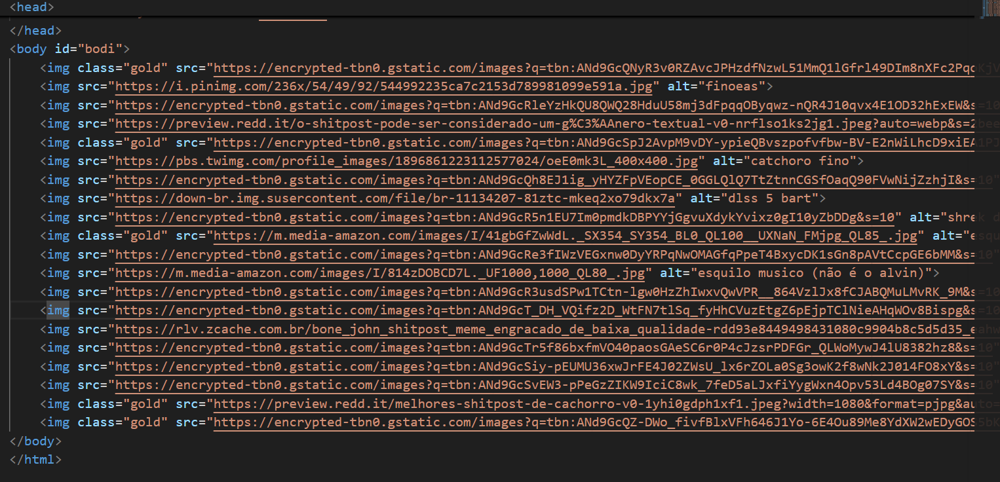
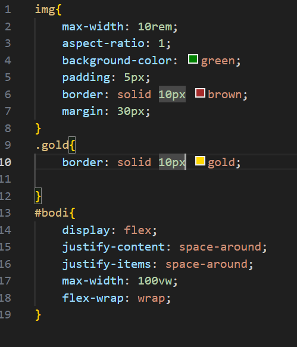
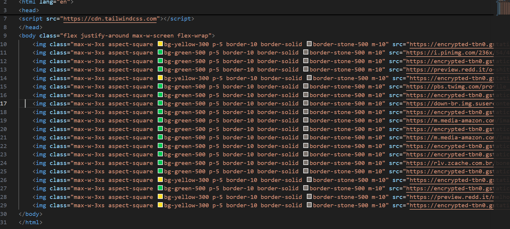

# Acesso para o repositório da atividade 6 e 6_2

[repositório css simples](https://github.com/Johann-Fera/html---css-simples.git)

[repositório css tailwind](https://github.com/Johann-Fera/html---tailwind-complicado.git)

[site css tailwind](https://html-tailwind-complicado.vercel.app/)

css simples

css tailwind

html sem tailwind

css da versão sem tailwind

html com tailwind

classes usadas

- max-w-3xs: max-width: 16rem;
- aspect-square: aspect-ratio: 1 / 1;
- bg-yellow-300: background-color: oklch(90.5% 0.182 98.111);
- bg-green-500: background-color: oklch(72.3% 0.219 149.579);
- p-5: padding: 5px;
- border-10: border-width: 10px;
- border-solid: border-style: solid;
- border-stone-500: border-color: oklch(55.3% 0.013 58.071);
- m-10: margin: 10px;
